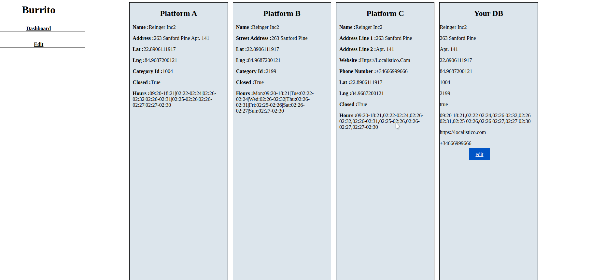
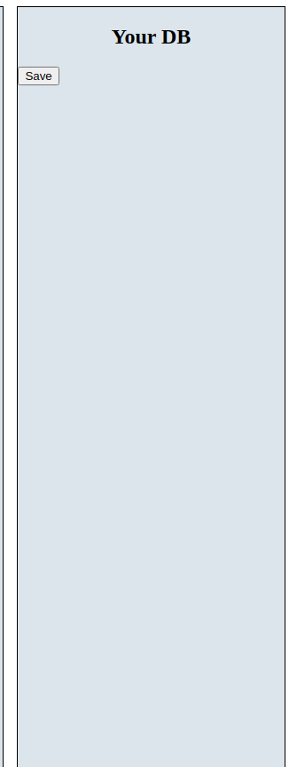
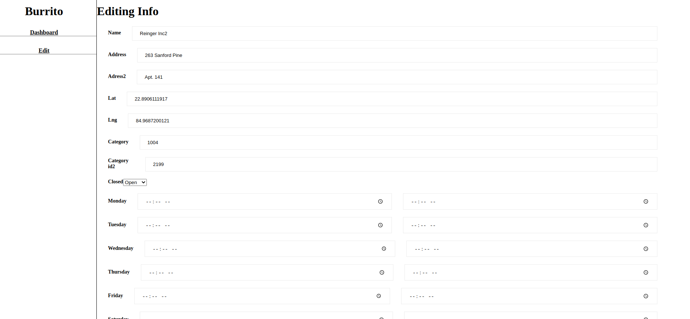

# Burrito 

An app that allows users to to update their accounts on multiple platforms.

On a new version it will allow the user to schedule closed times for holidays.

## Built With

- Ruby
- Ruby on Rails
- Jquery
- HTML
- SCSS (Implemented BEM methodology)
- Rspec
- HTTParty
- Rubocop

## Getting Started

Open the [Live Demo Link](https://burritos.herokuapp.com/).

## Author

👤 António Fernandes

[Github](https://github.com/trox115) | [Twitter](https://twitter.com/rock_67) | [LinkedIn](https://www.linkedin.com/in/antoniomfernandes/) | [Email](mailto:email@antoniofernandes.com) | [Portfolio](https://www.antoniofernandes.com/)

## 🤝 Contributing

Contributions, issues, and feature requests are welcome!

Feel free to check the issues page.

## Future Features:

- [ ] Implement Transitions.
- [ ] Improve UI/UX.
- [ ] Schedule Holidays.
- [ ] Insert more platforms.
- [ ] Coordinates through a map.

## Show your support

Give a star ⭐️ if you like this project!

## Burrito

To view, the live demo click the [link](https://burritos.herokuapp.com/) and you will be taken to dashboard page.




### Update your DB

If you install the project locally, at the first login you will see a button to update your database with the data from the Api. The platform A, will be the master, meaning that if you have 2 fields, with the same key but different values, only the one one platform A will be considered. 



### Edit your databases

You may now choose edit the info on the database by clicking on sidebar 'Edit' or on the link bellow your Database Card.
Yow will then see a form



As soon as you submit by clicking on the button, you will wait until the informations on api are stored too.

## Warning 
You may edit hours for each day of the week individaully or you can do so from the hours field. Keep in mind that if you have your hours field with values, as soon ass you change a day of the week, the data will be erased and you need to select hours for all days of the week.

## Warning - External Problems.
When you use this app it is possible, that for some reason one or more platforms are down. You can still edit your database, if the app can not save the results on the platforms it will wait and try again multiple times.If by the end of the defined time, still is not possible, it will save the info on a stack and try again later so that you don't have to insert all information again.

# Required Installations

If you want a copy of this project running on your machine you have to install:

- Ruby 2.6.3
- Rails 6.0.0

For installation instructions follow [The Installation Guide](https://www.tutorialspoint.com/ruby-on-rails/rails-installation)

# Installation of This App

Once you have installed the required packages shown on the [Required Installations](), proceed with the following steps

Clone the Repository, the folder burritos will be downloaded

```Shell
your@pc:~$ git clone https://github.com/trox115/burritos.git
```

Move to the downloaded folder

```Shell
your@pc:~$ cd burritos
```

Install gems

```Shell
your@pc:~$ bundle install --without production
```

Migrate the databases

```Shell
your@pc:~$ rails db:create
your@pc:~$ rails db:migrate
```

In order to make this app safer, you should configure your secrets before continuing, for that you just need to type:
```Shell
your@pc:~$ EDITOR='code --wait' rails credentials:edit
```
Note that: 'code' is for using VScode, so adjust to your editor.

the editor will prompt and you need to paste this

```yml
api:
  base_uri: 'https://rails-code-challenge.herokuapp.com/platform_'
  api_key: 'yourApi'
```


Finally, run the test suite to verify that everything is working correctly:

```Shell
your@pc:~$ rspec
```

If the test suite passes, you'll be ready to run the app in a local server:

Lastly, run the server

```Shell
your@pc:~$ rails server

```

Then, go to [http://localhost:3000/](http://localhost:3000/)

Voila!

You have your project running.


### License

This project is MIT licensed.
